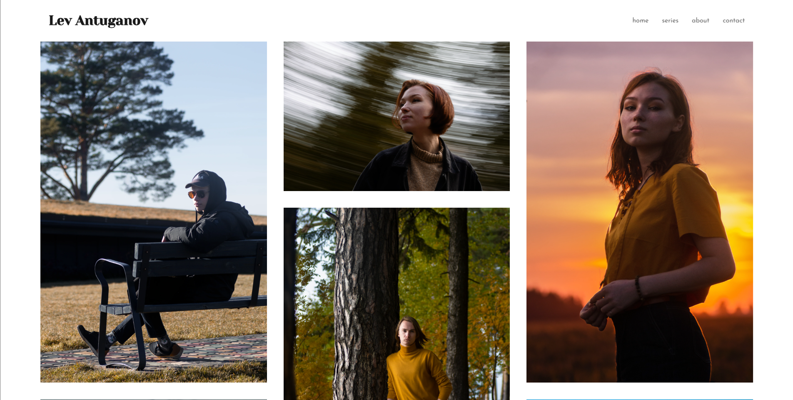
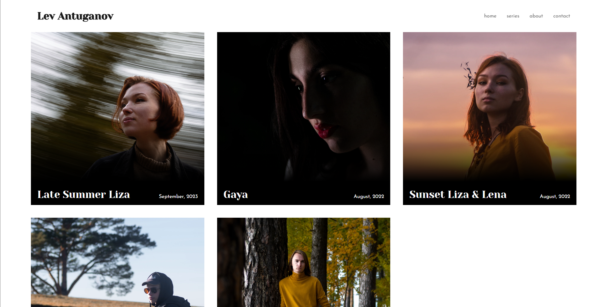
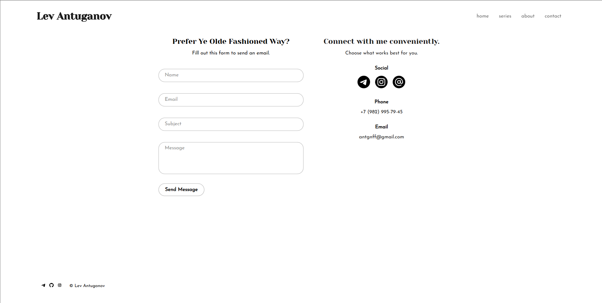

# Photographer Portfolio

This project is a pretty simple and common photographer portfolio website built with Django. You can see it live here: [https://photographer-portfolio-wknx.onrender.com/](https://photographer-portfolio-wknx.onrender.com/)

## What it Does
- Displays photos in adaptable grids.
- Organizes images into series.
- Includes a contact form and "About" section.

## Screenshots

  

## Tools
### Backend
- **Django**: Python web framework.

### Frontend
- **HTML, CSS, and JavaScript**.
- **JavaScript Libraries**: 
  - **Colcade.js and Masonry.js**: For grid layouts.
